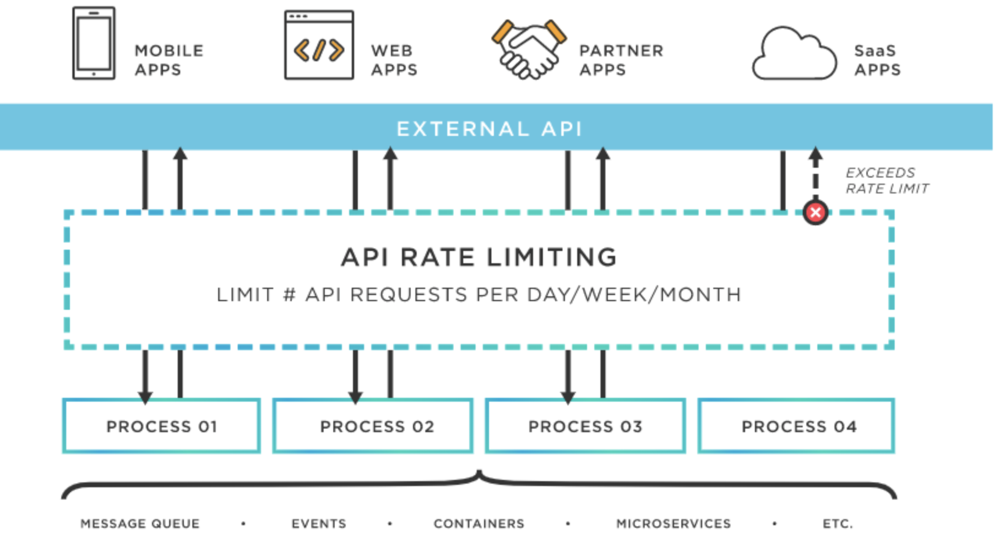
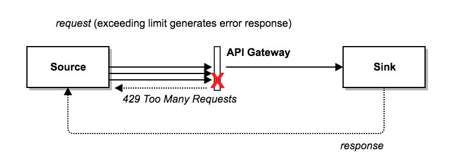
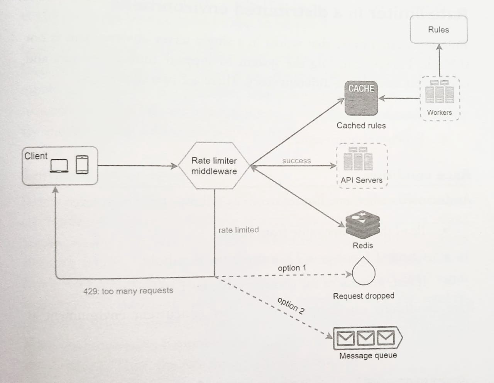

# Rate Limtter(처리율 제한 장치)

서비스를 운영하다보면 의도적이든 의도적이지 않던간에 서비스의 가용성(API레벨, 네트워크 레벨, 컨테이너 레벨, CPU 레벨이든)을 유지하기 위해서 클라이언트의 과도한 사용에 대해 스스로를 보호해야 합니다. 

이 때 사용되는 Rate Limtter는 클라이언트 또는 서비스가 보내는 트래픽의 처리율을 제어하기 위한 장치입니다. 

HTTP로 예를 들면 이 장치는 특정 기간 내에 전송되는 클라이언트의 요청 횟수를 제한합니다. API의 요청 횟수가 제한 장치에 정의된 임계치를 넘어서면 추가로 도달한 모든 호출은 처리가 중단됩니다.

> 간과하기 쉽지만, 서비스의 가용성을 유지하기 위한 노력은 클라이언트 측(앱/웹))에도 같이 설계를 해주는 것이 바람직합니다.

### Rate Limitter 가 필요한 이유

1. 과도한 트래픽으로부터 서비스(자원)를 보호.
   - DOS(Denial of Service) 공격에 의한 자원 고갈 방지
2. 트래픽 비용이 서비스 예산을 넘는 것을 방지.
3. Resource 사용에 대한 공정성과 합리성 유도.
4. Rate에 대해 과금을 부과하는 Business Model로 활용.
   - 프리미엄 사용자는 한달에 3개까지만 포스팅을 볼 수 있도록 함

### 주요 서비스들의 Rate Limit 정보

| 사이트   | 제한 정보                                                    | 참조 사이트                                                  |
| -------- | ------------------------------------------------------------ | ------------------------------------------------------------ |
| 트위터   | 1일 100 트윗                                                 | [Twitter Rate Limits](https://developer.twitter.com/en/docs/basics/rate-limits) |
| 깃허브   | Basic Authentication or OAuth 활용한 API는 시간당 5000건, 미인증 API는 시간당 60건 | [Github Rate Limits](https://developer.github.com/v3/#rate-limiting) |
| 슬랙     | 메시지 게시는 초당 1회, 다른 Web API methods는 분당 1 ~ 100회, Events는 시간당 30,000 | [Slack Rate Limits](https://api.slack.com/docs/rate-limits)  |
| 페이스북 | Applications은 시간당 유저수 * 200                           | [Facebook Rate Limits](https://developers.facebook.com/docs/graph-api/overview/rate-limiting/) |
| 쇼파이   | 40 Bucket size는 초당 2건, 80 Bucket size는 초당 4건         | [Shopify Rate Limits](https://help.shopify.com/en/api/reference/rest-admin-api-rate-limits) |

## 1단계 문제 이해 및 설계 범위 확정

처리율 제한 장치의 시스템 요구사항을 다음의 예와 같이 확정합니다.

**처리율 제한 장치 설계 범위 예시**

- 설정된 처리율을 초과하는 요청은 정확하게 제한한다.

- 낮은 응답시간: 이 처리율 제한 장치는 HTTP 응답시간에 나쁜 영향을 주어서는 곤란하다.

- 가능한 한 적은 메모리를 써야 한다.

- 분산형 처리율 제한: 하나의 처리율 제한 장치를 여러 서버나 프로세스에 공유할 수 있어야 한다.

- 예외 처리: 요청이 제한되었을 떄는 그 사실을 사용자에게 분명하게 보여주어야 한다.

- 높은 결함 감내성: 제한 장치에 장애가 생기더라도 전체 시스템에 영향을 주어서는 안된다.

## 2단계 개략적 설계안 제시 및 동의 구하기

**처리율 제한 장치는 어디에 둘것인가 ?**

1. 클라이언트에 두기

   - 일반적으로 클라이언트는 안정적으로 제한을 걸 수 없습니다. 클라이언트 요청은 위변조가 쉽게 가능하기 때문입니다.모든 클라이언트의 구현을 통제하는 것도 어려울 수 있습니다.

2. 서버에 두기

3. 미들웨어를 만들어 해당 미들웨어로 하여금 API 서버로 가는 요청을 통제

   - 클라우드 마이크로 서비스의 경우 처리율 제한 장치는 보통 API 게이트웨이라 불리는 컴포넌트에 구현됩니다.

   > API 게이트웨이는 처리율 제한, SSL 종단, 사용자 인증, IP 허용 목록 관리 등을 지원하는 완전 위탁관리형 서비스 즉 클라우드 업체가 유지보수를 담당하는 서비스입니다. 일단은 API 게이트웨이가 처리율 제한을 지원하는 미들웨어 라는 점만 기억하도록 합시다.

**일반적인 지침**

1. 프로그래밍 언어, 캐시 서비스 등 현재 사용하고 있는 기술 스택을 점검하고 현재 사용하는 프로그래밍 언어가 서버측 구현을 지원하기 충분할 정도로 효율이 높은지 확인하라.
2. 여러분의 사업 필요에 맞는 처리율 제한 알고리즘을 찾아라. 서버측에서 구현하기로 했다면 알고리즘 선택은 자유롭지만 서드파티의 게이트웨이를 사용한다면 폭은 제한된다.
3. 설계가 마이크로서비스에 기반하고 있고 사용자 인증이나 IP 허용목록 관리등을 처리하기 위해 API 게이트웨이를 이미 설계에 포함시켰다면 처리율 제한 기능 또한 게이트웨이에 포함시켜야 할 수도 있다.
4. 처리율 제한 서비스를 직접 만드는 데는 시간이 든다. 처리율 제한 장치를 구현하기에 인력이 없다면 상용 API 게이트웨이를 쓰는것이 바람직한 방법일 것이다.

> ⚠️ Service Mesh 가 생기면서...
>
> - 알고리즘은 조금 덜 신경써도 된다.
> - 사이드카 패턴

**개략적인 아키텍처**

처리율 제한 알고리즘의 기본 아이디어는 단순합니다. 얼마나 많은 요청이 접수 되었는지를 추적할 수 있는 카운터를 추적 대상 별(사용자 별로 할 것인가? IP주소 별로? 아니면 API 엔드포인트나 서비스 단위로?)로 이 카운터의 값이 어떤 한도를 넘어서면 한도를 넘어 도착한 요청은 거부하는 것이죠.

그렇다면 이 카운터는 어디에 보관할 것인가? 데이터베이스는 디스크 접근때문에 느립니다. 메모리상에 동작하는 캐시가 바람직한데 빠른데다 시간에 기반한 만료 정책을 지원하기 때문입니다.

일례로 레디스는 처리율 제한 장치를 구현할 때 자주 사용되는 메모리 기반 저장장치로서 INCR과 EXPIRE의 두가지 명령어를 지원하고 있습니다.

- INCR: 메모리에 저장된 카운터의 값을 1만큼 증가시킨다.
- EXPIRE: 카운터에 타임아웃 값을 설정한다. 설정된 시간이 지나면 카운터는 자동으로 삭제된다.

**동작 원리**

- 클라이언트가 처리율 제한 미들웨어에 요청을 보낸다.
- 처리율 제한 미들웨어는 레디스의 지정 버킷에서 카운터를 가져와 한도에 도달했는지 검사
  - 한도에 도달하면 요청은 거부
  - 한도에 도달하지 않았다면 API 서버로 전달.
- 미들웨어는 카운터 값을 증가시킨 후 레디스에 저장한다.

> AWS API gateway는 per 5000을 넘을 수 없다. (별도 요청이 필요)

## 3단계 상세 설계

- 처리율 제한 규칙은 어떻게 만들어지고 어디에 저장되는가?

- 처리가 제한된 요청들은 어떻게 처리되는가?

#### **처리율 제한 규칙**

- 규칙이 설정 파일인 경우는 디스크에 저장합니다.

#### **처리율 한도 초과 트래픽의 처리**

- 경우에 따라서 제한에 초과된 트래픽을 버리는것만이 아닌 따로 큐에 모아놓고 나중에 처리할 수도 있습니다.

**처리율 제한 장치가 사용하는 HTTP 헤더**

- HTTP 처리율 장치는 HTTP 응답 헤더를 통해 요청이 처리율 제한에 걸리기까지 얼마나 많은 요청을 보낼수 있는지, 자기 요청이 처리율 제한에 걸리고 있는지를 어떻게 감지하는지를 알 수 있습니다.

  - X-Ratelimit-Remaining: 윈도 내에 남은 처리 가능 요청의 수

  - X-Ratelimit-Limit: 매 윈도마다 클라이언트가 전송할 수 있는 요청의 수

  - X-Ratelimit-Retry-After: 한도 제한에 걸리지 않으려면 몇초 뒤에 요청을 다시보내야 하는지 알림

  - 사용자가 너무 많은 요청을 보내면 429 too many requests 오류를 X-Ratelimit-Retry-After 헤더와 함께 반환

### 상세 설계

1. 처리율 제한 규칙은 디스크에 보관한다.
2. 작업 프로세스는 수시로 규칙을 디스크에서 읽어 캐시에 저장한다.
3. 클라이언트가 요청을 서버에 보내면 요청은 먼저 처리율 제한 미들웨어에 도달한다.
4. 처리율 제한 미들웨어는 제한 규칙을 캐시에서 가져온다.
5. 아울러 카운터 및 마지막 요청의 타임스탬프를 레디스 캐시에서 가져온다.
6. 가져온 값들에 근거하여 미들웨어는 요청을 처리한다.
   - 제한에 안걸리면 API 서버로 보낸다.
   - 제한에 걸리면 429 에러를 클라이언트에 보내고 요청을 버릴수도 있고
   - 요청을 큐에 넣어 보관할수도 있다.

### 분산 환경에서의 처리율 제한 장치의 구현

- 여러대의 서버와 병렬 스레드를 지원하도록 시스템을 확장하는 것은 **경쟁조건**과 **동기화**의 문제를 풀어내야 한다

#### 경쟁조건

다음과 같이 경쟁조건 문제가 발생할 수 있습니다.

- 레디스에서 카운터의 값을 읽는다.
- count+1의 값이 임계치를 넘는지 본다.
- 넘지 않는다면 레디스에서 보관된 카운터 값을 1만큼 증가시킨다.
- 병행성이 심한 환경에서는 각각 병렬로 count의 값을 읽어 다른 요청의 처리 상태는 상관하지 않고 count에 1을 더한 값을 레디스에 저장할 것이다.

이런 경우 락을 처리해서 처리하는 것이 알려진 해결책이지만, 락은 시스템 성능을 떨어뜨립니다. 락 대신 쓸 수 있는 해결책 두 가지가 있습니다.

1. lua 스크립트

2. [레디스의 정렬 집합](https://engineering.classdojo.com/blog/2015/02/06/rolling-rate-limiter/)

#### 동기화 이슈

동기화는 분산환경에서 고려해야 할 또다른 중요한 요소입니다. 대규모 환경에서는 한대의 처리율 제한 장치로는 서버가 충분하지 않을수 있습니다. 처리율 제한 장치 서버를 여러대 두게되면 동기화가 필요해지죠.

이에 대한 해결책중 하나는 스티키 세션을 활용하여 같은 클라이언트로의 요청은 항상 같은 처리율 제한장치로 보낼수 있도록 하는것입니다. 하지만 이 방식은 규모면에서 확장 가능하지도 않고 유연하지도 않기 때문에 비추천합니다.

더 나은 방법은 레디스와 같은 중앙 집중형 데이터 저장소를 사용하는 것입니다.

> - 샤드
> - 레디스 클러스터

#### 성능 최적화

1. 엣지 서버

   - 데이터센터에서 멀리 떨어진 사용자를 지원하려다 보면 레이턴시가 증가할 수 밖에 없습니다. 
   - 사용자의 트래픽을 가까운 에지서버로 전달하여 레이턴시를 줄입니다.

   > CloudFront Accelorator
   >
   > - CloudFront - ... - KT 망 장애 - 내부망/IDC
   > - CloudFront - 전용선 - 내부망/IDC
   >   -  홉을 줄인다.
   >   - 은행의 HTS...

2. 제한장치간의 데이터를 동기화할 때 최종 일관성 모델을 사용
   - 6장을 참고

#### 모니터링

다음의 지표를 보기 위해 모니터링이 필요합니다.

1. 채택된 처리율 제한 알고리즘이 효과적인지?

2. 정의한 처리율 제한 규칙이 효과적인지?

## 4단계 마무리

고려해볼 만한 사항

- hard 또는 soft 처리율 제한

  - hard 제한: 요청의 개수는 임계치를 절대 넘어설수 없다.
  - soft 제한: 요청 개수는 잠시 동안은 임계치를 넘을수 있다.

- 다양한 계층에서의 처리율 제한
  - 이번장은 애플리케이션 계층에서의 처리율만 확인했지만 iptables를 사용하면 네트워크 계층에서도 처리할 수 있다.

- 처리율 제한을 회피하는 방법

  - 클라이언트 측 캐시를 사용하여 API 호출을 줄인다.
  - 처리율 제한의 임계치를 이해하고 짧은 시간 동안 너무 많은 메시지를 보내지 않도록 한다.
  - 예외나 에러를 처리하는 코드를 도입하여 클라이언트가 예외적 상황으로부터 우아하게 복구될 수 있도록 한다.
  - 재시도 로직을 구현할 때는 충분한 백오프 시간을 둔다.

  > 지수 백오프

## 참고

- [Architect Rate Limiter - Medium](https://medium.com/wineofbits/designing-a-distributed-rate-limiter-introduction-731afd345a66)

- 대규머 시스템 설계 기초 - 알렉스 쉬