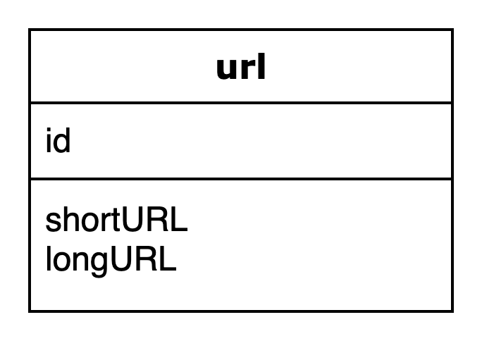
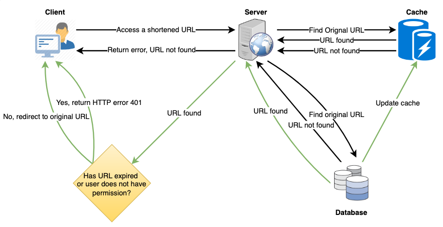
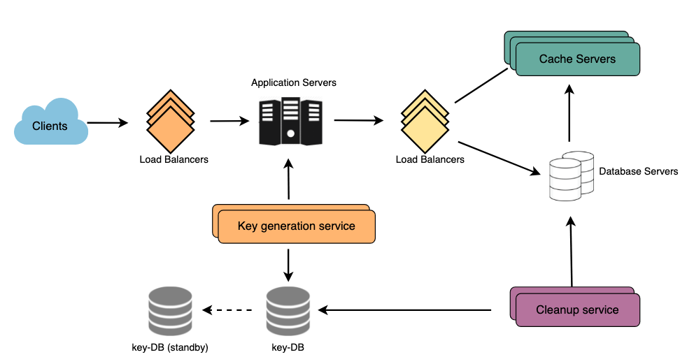

## 08. URL Shortening 서비스 시스템 설계


***TINYURL 사이트의 모습***

[TinyURL](https://tinyurl.com/app) 과 같은 URL 단축 서비스를 설계해보도록 합시다. 이 서비스는 긴 URL으로 리다이렉트 할 수 있는 짧은 별칭을 제공합니다.


## 1. 문제 이해 및 설계 범위 확정

### 1.1 URL 단축이 왜 필요할까?

URL 단축은 긴 URL에 대해 더 짧은 별칭을 만드는 데 사용됩니다. 이러한 단축된 별칭을 `Short Link` 라고 부릅니다. 유저는 이러한 짧은 링크를 클릭하면 원래 URL로 리디렉션됩니다. `Short Link` 는 표시하거나, 인쇄하거나, 메시지로 전송하고나, 트윗할 때 많은 공간을 절약할 수 있습니다. 또한 유저는 더 짧은 URL을 잘못 입력할 가능성이 적습니다.

예를 들어 TinyURL을 통해 다음 URL을 줄이면

```
https://www.educative.io/courses/grokking-the-system-design-interview/m2ygV4E81AR
```

아래와 같은 단축 URL 을 얻을 수 있습니다.

```
https://tinyurl.com/rxcsyr3r
```

단축된 URL은 실제 URL의 거의 1/3 크기입니다.

URL 단축은 여러 장치에서 링크를 최적화하고, 개별 링크를 추적하여 잠재고객을 분석하고, 광고 캠페인의 실적을 측정하거나, 연결된 원본 URL을 숨기는 데 사용됩니다.


### 1.2 시스템 요구사항 및 목표

> 💡 면접 시작 시 항상 요구 사항을 명확히 해야 합니다. 면접관이 염두에 두고 있는 시스템의 정확한 범위를 찾기 위해 질문을 해야 합니다.

URL 단축 시스템은 다음 요구 사항을 충족해야 합니다.

**기능 요구 사항:**

1. URL이 주어지면 서비스에서 더 짧고 고유한 별칭을 생성해야 합니다. 이 링크는 응용 프로그램에 쉽게 복사하여 붙여넣을 수 있을 만큼 짧아야 합니다.
2. 사용자가 짧은 링크에 액세스하면 당사 서비스는 사용자를 원래 링크로 리디렉션해야 합니다.
3. 단축된 URL에는 숫자와 영문자만 사용되어야 합니다.
4. ~~사용자는 선택적으로 자신의 URL에 대한 사용자 정의 짧은 링크를 선택할 수 있어야 합니다.~~
5. ~~링크는 기본 시간이 지나면 만료됩니다. 사용자는 만료 시간을 지정할 수 있어야 합니다.~~

**비기능 요구 사항:**

1. 고가용성 :  서비스가 다운되면 모든 URL 리디렉션이 실패하기 시작하기 때문에 필요합니다.
2. URL 리디렉션은 최소한의 대기 시간으로 실시간으로 발생해야 합니다.
3. 단축된 링크는 추측할 수 없어야 합니다(예측할 수 없음).

**확장된 요구 사항:**

1. 모니터링, 예를 들어 리디렉션이 몇 번이나 발생했습니까?
2. 우리 서비스는 다른 서비스에서도 REST API를 통해 액세스할 수 있어야 합니다.


### 1.3 트래픽 추정 및 제약사항

우리 시스템은 읽기가 많을 것입니다. 새로운 URL 단축에 비해 더 많은 리디렉션 요청이 있을 것입니다. 읽기와 쓰기의 비율이 10:1이라고 가정해 보겠습니다.

**트래픽(Traffic) 추정치**

10:1 읽기/쓰기 비율로 매월 30억 개의 새로운 URL 단축이 발생한다고 가정하면 같은 기간 동안 300억의 리디렉션을 기대할 수 있습니다.
$$
10 * 30억 => 300억
$$
우리 시스템의 QPS(초당 쿼리 수)는 얼마입니까? 초당 새로운 단축 URL:
$$
30억 / (30일 * 24시간 * 3600초) = ~1200 URL/s
$$
10:1 읽기/쓰기 비율을 고려할 때 초당 URL 리디렉션은 다음과 같습니다.
$$
10 * 1200 URL/초 = 12K/초
$$


**저장(Storage) 추정치** 

모든 URL 단축 요청(및 관련 단축 링크)을 10년 동안 저장한다고 가정해 보겠습니다. 매월 30억 개의 새 URL이 있을 것으로 예상하므로 저장할 것으로 예상되는 총 개체 수는 3600억 개입니다.
$$
30억 * 10년 * 12개월 = 3600억
$$
저장된 각 객체가 약 100바이트라고 가정해 봅시다. 총 36.5TB의 스토리지가 필요합니다.
$$
3600억 * 100바이트 = 36.5TB
$$


**대역폭(Bandwith) 추정치**

쓰기 요청의 경우 초당 1200개의 새 URL이 예상되므로 서비스에 대한 총 수신 데이터는 초당 120KB가 됩니다.
$$
1200 * 100바이트 = 120KB/초
$$
읽기 요청의 경우 초당 12K개의 URL 리디렉션이 예상되므로 서비스의 총 나가는 데이터는 초당 1.2MB가 됩니다.
$$
12K * 100바이트 = 1.2MB/s
$$


**메모리(Memory) 추정치** 

자주 액세스하는 핫 URL 중 일부를 캐시하려면 이를 저장하는 데 얼마나 많은 메모리가 필요합니까? 20% URL이 80%의 트래픽을 생성한다는 80-20 규칙을 따라 이 20% 핫 URL을 캐시한다고 가정합니다.

> **✏️ [80-20 Rule](https://www.linkedin.com/pulse/8020-rule-software-development-chong-yu/)**
>
> *결과의 80%가 원인의 20%에서 온다*
>
> - 80-20 법칙은 결과(산출)의 80%가 원인(투입)의 20%에서 나온다고 주장합니다.
> - 80-20 규칙에서는 최상의 결과를 생성할 요소의 20%를 우선순위로 지정합니다.
> - 80-20 법칙의 원칙은 최고의 자산을 식별하고 이를 효율적으로 사용하여 최대 가치를 창출하는 것입니다.


초당 12,000개의 읽기 요청이 있으므로 하루에 약 10억 개의 요청을 받게 됩니다.
$$
12K * 3600초 * 24시간 = 10억
$$


이러한 요청의 20%를 캐시하려면 약 100GB의 메모리가 필요합니다.
$$
0.2 * 103억 * 500바이트 = ~100GB
$$
여기서 주의할 점은 동일한 URL에 대한 중복 요청이 많기 때문에 실제 메모리 사용량은 100GB 미만입니다.


**대략적인 추정치** 매월 30억 개의 새로운 URL과 10:1 읽기:쓰기 비율을 가정할 때 다음은 당사 서비스에 대한 대략적인 추정치를 요약한 것입니다.

| URL 유형           | 예상 시간 |
| ------------------ | --------- |
| 새 URL             | 1200/초   |
| URL 리디렉션       | 12K/s     |
| 수신 데이터        | 120KB/초  |
| 발신 데이터        | 1.2MB/초  |
| 10년간 보관될 용량 | 36.5TB    |
| 캐시용 메모리      | 100GB     |


## 2. 개략적 설계안 제시 및 동의 구하기

### 2.1. API

> 💡 요구 사항을 확정하고 나면 항상 시스템 API를 정의하는 것이 좋습니다. 이것은 시스템에서 기대되는 것을 명시적으로 명시해야 합니다.

클라이언트가 통신할 URL 단축기 서비스의 API를 RESTful API로 설계합니다. 

**URL 단축 요청 endpoint**

```
POST /api/v1/data/shorten
```

- 인자: { longUrl: longURLString }
- 반환: 단축 URL

**URL 리디렉션용 endpoint**

```
POST /api/v1/shortUrl
```

- 반환: HTTP 리디렉션 목적지가 될 원래 URL


### 2.2 저장 방법

URL 리디렉션을 구현하는 가장 직관적인 방법은 해시 테이블을 사용하는 것입니다. 해시 테이블에 <단축 URL, 원래 URL> 쌍을 저장한다면 리디렉션은 다음과 같이 구현될 수 있습니다.

- 원래 URL = hashTable.get(단축 URL)
- 301 또는 302 응답 Location 헤더에 원래 URL을 넣은 후 전송

하지만 메모리는 유한하고 비싸기 때문에 실제 시스템에서 해시 테이블에 두기에는 곤란합니다. 데이터베이스에 저장하는 것이 더 나은 방법입니다.


### 2.3 데이터베이스 디자인

> 💡 인터뷰 초기 단계에서 DB 스키마를 정의하면 다양한 구성 요소 간의 데이터 흐름을 이해하는 데 도움이 되고 나중에 데이터 분할에 대한 지침이 됩니다.

**우리가 저장할 데이터의 특성**

1. 수십억 개의 기록을 저장해야 합니다.
2. 우리가 저장하는 각 객체는 작습니다(1K 미만).
3. 어떤 사용자가 URL을 생성했는지 저장하는 것 외에는 레코드 간에 관계가 없습니다.
4. 우리 서비스는 읽기가 많습니다.


#### 데이터베이스 스키마



***URL 테이블***

URL 매핑에 대한 정보를 저장하기 위한 테이블이 위와 같이 필요합니다.


#### 데이터베이스 선정

수십억 개의 행을 저장할 것으로 예상하고 객체 간의 관계를 사용할 필요가 없기 때문에 [DynamoDB](https://en.wikipedia.org/wiki/Amazon_DynamoDB) , [Cassandra](https://en.wikipedia.org/wiki/Apache_Cassandra) 또는 [Riak](https://en.wikipedia.org/wiki/Riak) 과 같은 NoSQL 저장소 가 더 나은 선택입니다. NoSQL을 선택하면 확장도 더 쉬울 것입니다.


## 3. 상세 설계

### 3.1 기본 시스템 설계 및 알고리즘

여기서 우리가 해결하려는 문제는 주어진 URL에 대해 짧고 고유한 키를 생성하는 방법입니다. 이 때 해시 함수가 사용됩니다. 


#### 해시 함수

해시 함수 결과값은 요구사항에 따라 `0~9`, `a-z`,`A-Z` 의 문자들로 구성됩니다. 사용할 수 있는 개수는 62개 입니다.
$$
10 + 26 + 26 = 62
$$


URL 단축기 서비스는 요구사항에 따라 3650억개의 데이터를 저장하기에 충분한 키가 생성될 수 있어합니다. 

***62진수의 값 표현 범위***

| n    | URL 개수             |
| ---- | -------------------- |
| 1    | 62¹ = 62             |
| 2    | 62² = 약 3K          |
| 3    | 62³ = 약 238K        |
| 4    | 62⁴ = 약 14M         |
| 5    | 62⁵ = 약 916M        |
| 6    | 62⁶ = 약 56B(560억)  |
| 7    | 62⁷ = 약 3.5T(3.5조) |
| 8    | 62⁸ = 약 218T        |

한 글자에 62개씩 7개로 이루어진 키라면 약 3.5조개의 URL을 만들 수 있습니다. 이에 따라 해시값의 길이는 7로 설정합니다.


##### 해시 충돌 후 해소

손쉽게 URL을 해시하는 방법은 기존에 알려진 `CRC32`, `MD5`, `SHA` 같은 함수를 쓰는 것입니다. 하지만 해시 후 길이가 제일 짧은 `CRC32` 도 7개가 넘어갑니다. 해시 충돌 후 해소 방법은 해시 값에서 처음 7개만 사용하는 것입니다. 이렇게 되면 충돌 확률이 높아지는데 실제 충돌 시에는, 충돌이 해소될 때까지 사전에 정한 문자열을 붙입니다.


##### base62 변환

1. 입력으로 긴 URL을 받는다.
2. 데이터베이스에 해당 URL이 있는지 검사한다.
3. 있으면 해당 단축 URL을 클라이언트에게 반환한다.
4. 없는 경우 유일한 ID를 생성하고 데이터베이스 기본 키로 사용한다.
5. base62를 이용해 ID를 단축 URL로 만든다.
6. ID, 단축 URL, 원래 URL로 새 레코드를 추가한 후 단축 URL을 클라이언트에게 반환한다.

입력 URL이 `https://en.wikipedia.org/wiki/Systems_design` 라고 이 URL에 대해 ID 생성기가 반환한 ID는 `2021117674938`라고 가정한다. 이 아이디를 62진수로 [변환](https://www.scopulus.co.uk/tools/hexconverter.htm)하면 `zA8HN6q`가 나옵니다. 이를 기반으로 레코드를 생성합니다.

***base62 변환으로 생성된 단축 URL 예시***

| ID            | shortURL | longURL                                     |
| ------------- | -------- | ------------------------------------------- |
| 2021117674938 | zA8HN6q  | https://en.wikipedia.org/wiki/Systems_desig |


##### 두 접근법 비교

| 해시 후 충돌 해소                                            | base62 변환                                                  |
| ------------------------------------------------------------ | ------------------------------------------------------------ |
| 단축 URL 길이 고정                                           | 단축 URL 길이 가변(ID가 커디면 같이 길어짐)                  |
| 유일성이 보장되는 ID 생성기 필요하지 않음                    | 유일성  보장 ID 생성기 필요                                  |
| 충돌할 수 있어 해소 전략 필요                                | ID 유일성이 보장된 후에 적용 가능한 전략이라 충돌 불가능     |
| ID로부터 단축 URL을 만드는 것이 아니라 다음에 쓸 수 있는 URL을 알아내는 것이 불가능 | ID가 1씩 증가하는 값이라고 가정하면 다음에 쓸 수 있는 URL이 무엇인지 쉽게 알아낼 수 있어 보안상 문제가 될 수 있음 |


### 3.2 캐시



자주 액세스하는 URL을 캐시할 수 있습니다. 전체 URL을 해당 해시와 함께 저장할 수 있는 [Memcached](https://en.wikipedia.org/wiki/Memcached) 와 같은 솔루션을 사용할 수 있습니다. 따라서 애플리케이션 서버는 백엔드 스토리지에 도달하기 전에 캐시에 원하는 URL이 있는지 빠르게 확인할 수 있습니다.

**필요한 메모리 용량** 

일일 트래픽의 20%로 시작할 수 있으며 클라이언트의 사용 패턴에 따라 필요한 캐시 서버 수를 조정할 수 있습니다. 위에서 예상한 대로 일일 트래픽의 20%를 캐시하려면 100GB의 메모리가 필요합니다. 최신 서버는 256GB의 메모리를 가질 수 있으므로 모든 캐시를 하나의 시스템에 쉽게 맞출 수 있습니다. 또는 이 모든 핫 URL을 저장하기 위해 몇 대의 더 작은 서버를 사용할 수 있습니다.


## 4. 마무리

> 💡 설계를 마친 후에도 시간이 남는다면 다음과 같은 것들을 더 논의해보는 것이 좋습니다.


### 추가 고려 사항

#### **처리율 제한**

지금까지 살펴본 서비스는 엄청난 양의 URL의 단축 요청이 밀려들 경우 무력화될 수 있어 잠재적 보안 결함을 갖고 있습니다. 처리율 제한 장치를 둠으로서 요청을 걸러낼 수 있습니다.


#### **웹 서버 규모 확장**

웹 계층은 무상태이므로 자유로이 증설하거나 삭제할 수 있습니다.


#### **데이터베이스 규모 확장**

DB를 확장하려면 수십억 개의 URL에 대한 정보를 저장할 수 있도록 파티셔닝해야 합니다. 따라서 데이터를 서로 다른 DB 서버에 나누어 저장하는 파티셔닝 방식을 개발해야 합니다.

- 범위 기반 파티셔닝
  - 해시 키의 첫 글자를 기반으로 URL을 별도의 파티션에 저장할 수 있습니다. 따라서 문자 'A'(및 'a')로 시작하는 모든 URL을 한 파티션에 저장하고 문자 'B'로 시작하는 URL을 다른 파티션에 저장하는 식입니다. 이 접근 방식을 범위 기반 파티셔닝이라고 합니다. 덜 자주 발생하는 특정 문자를 하나의 데이터베이스 파티션으로 결합할 수도 있습니다. 따라서 항상 예측 가능한 방식으로 URL을 저장/찾을 수 있는 정적 분할 방식을 개발해야 합니다.
  - 이 접근 방식의 주요 문제점은 불균형한 DB 서버로 이어질 수 있다는 것입니다. 예를 들어, 문자 'E'로 시작하는 모든 URL을 DB 파티션에 저장하기로 결정했지만 나중에 문자 'E'로 시작하는 URL이 너무 많다는 것을 알게 됩니다.

- 해시 기반 파티셔닝
  -  이 체계에서 우리는 저장하고 있는 객체의 해시를 취합니다. 그런 다음 해시를 기반으로 사용할 파티션을 계산합니다. 우리의 경우 '키'의 해시 또는 짧은 링크를 사용하여 데이터 개체를 저장할 파티션을 결정할 수 있습니다.
  - 우리의 해싱 기능은 URL을 무작위로 다른 파티션에 배포합니다(예: 해싱 기능은 항상 '키'를 [1…256] 사이의 숫자에 매핑할 수 있습니다). 이 숫자는 객체를 저장하는 파티션을 나타냅니다.
  - 이 접근 방식은 여전히 오버로드된 파티션으로 이어질 수 있으며 이는 [Consistent Hashing을](https://www.educative.io/collection/page/5668639101419520/5649050225344512/5709068098338816/) 사용하여 해결할 수 있습니다 .


#### **데이터 정리**



항목은 영구적으로 유지되어야 합니까, 아니면 제거되어야 합니까? 사용자가 지정한 만료 시간에 도달하면 링크는 어떻게 됩니까?

만료된 링크를 계속 검색하여 제거하기로 선택했다면 데이터베이스에 많은 부담이 가해질 것입니다. (Expiration을 지원하는 NoSQL을 고려해보세요.) 대신 만료된 링크를 천천히 제거하고 지연 정리를 수행할 수 있습니다. 일부 만료된 링크는 더 오래 지속될 수 있지만 사용자에게 반환되지는 않습니다.

- 사용자가 만료된 링크에 액세스하려고 할 때마다 링크를 삭제하고 사용자에게 오류를 반환할 수 있습니다.
- 별도의 배치 서비스를 주기적으로 실행하여 스토리지 및 캐시에서 만료된 링크를 제거할 수 있습니다. 이 서비스는 매우 가볍고 사용자 트래픽이 적을 것으로 예상되는 경우에만 실행되도록 예약되어야 합니다.
- 각 링크에 대한 기본 만료 시간을 가질 수 있습니다(예: 2년).
- 만료된 링크를 제거한 후 키를 다시 Key DB에 넣어 재사용할 수 있습니다.
  - 티켓 서버 같은 경우에서 사용될 수 있습니다.
- 6개월과 같이 일정 기간 동안 방문하지 않은 링크를 제거해야 합니까? 이것은 까다로울 수 있습니다. 스토리지가 저렴해지고 있으므로 링크를 영원히 유지하기로 결정할 수 있습니다.


#### **모니터링**

성공적인 비지니스를 위해서는 데이터가 중요합니다. 많은 사용자가 클릭했는지, 언제 주로 클릭했는지, 방문자의 국가, 방문한 브라우저 등 중요한 정보를 알아낼 수 있습니다.


#### **보안 및 권한**

사용자가 개인 URL을 만들거나 특정 사용자 집합이 URL에 액세스하도록 제어해야하나요?

데이터베이스의 각 URL과 함께 권한 수준(공개/비공개)을 저장할 수 있습니다. 특정 URL을 볼 수 있는 권한이 있는 UserID를 저장하기 위해 별도의 테이블을 만들 수도 있습니다. 사용자에게 권한이 없고 URL에 액세스하려고 하면 오류(HTTP 401)를 다시 보낼 수 있습니다.


### 최종 설계

이제까지 다뤄본 시스템의 최종 설계는 다음과 같습니다.


**단축 요청**

1. 유저로부터 입력으로 긴 URL을 받는다.
2. 데이터베이스에 해당 URL이 있는지 검사한다.
3. 있으면 해당 단축 URL을 클라이언트에게 반환한다.
4. 없는 경우 유일한 ID를 생성하고 데이터베이스 기본 키로 사용한다.
5. 해시 함수를 이용해 ID를 단축 URL로 만든다.
6. ID, 단축 URL, 원래 URL로 새 레코드를 추가한 후 단축 URL을 클라이언트에게 반환한다


**리디렉션 요청**

1. 유저가 단축 URL을 클릭한다.
2. 로드밸런서가 해당 클릭으로 발생한 요청을 웹 서버에 전달한다.
3. 단축 URL이 캐시에 있는 경우 원래 URL을 바로 전달한다.
4. 캐시에 단축 URL이 없는 경우 데이터베이스에서 꺼낸다.
5. 데이터베이스에서 꺼낸 URL을 캐시에 넣은 후 사용자에게 반환한다.


## 참고

- [tinyurl.com](http://tinyurl.com/) 
- [grokking the system design interview](https://www.educative.io/courses/grokking-the-system-design-interview/m2ygV4E81AR)

