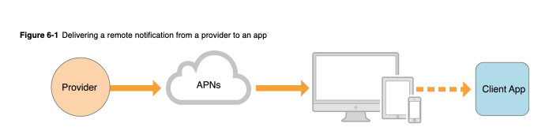

# 10.알림 시스템 설계

# 알림 시스템

고객이  중요할 만한 정보를 비동기적으로 제공

다양한 알림 시스템

- 모바일 푸시 알림, SMS 메시지, Email 등
- 왜 이것이 필요한가?

```json
약한 선형성
```

# 문제 제기 및 솔루션

1000K+ 알림을  처리하는 확장성 높은 시스템은 쉽지 않음

적절한 질문을 통해 요구사항이 무엇인지 파악

## 1단계 문제 이해 및 설계 범위 확정

```
어떤 종류의 알림을 지원?
- Push, SMS, Email

실시간 여부
- 연성 실시간(soft real-time)
- 가능한 빨리 전달되어야 하지만 시스템에 높은 부하가 걸렸을 때 약간의 지연은 허용

Device
- IOS, Android, Laptop/Desktop

알림 생성 주체
- 클라이언트 애플리케이션
- 서버측에서 스케줄링

알림 허용 여부(opt-out)설정 여부
- 허용

시스템 Capacity
- 천만건의 모바일 푸시
- 백만건의 SMS
- 5백만건의 Email
```

## 2단계 개략적 설계안 제시 및 동의 구하기

알림 유형별 지원 방안

연락처 정보 수집 절차

알림 전송 및 수신 절차

### iOS 푸시 알림

[APNs OverView](https://developer.apple.com/library/archive/documentation/NetworkingInternet/Conceptual/RemoteNotificationsPG/APNSOverview.html#//apple_ref/doc/uid/TP40008194-CH8-SW1)



- 알림 제공자(provider)
    - 알림 요청(notification request)을 만들어 알림 서비스 (APNs)로 보내는 주체
        - 단말 토큰(device token)과 페이로드(payload) 필요
    
- APNs(Apple Push Notification Service)
    - 애플이 제공하는 원격 서빗. 푸시 알림을 IOS 장치로 보내는 역할
- iOS 단말(iOS Device)
    - 푸시 알림을 수신하는 사용자 단말

### 안드로이드, SMS, 이메일 모두 유사

- 중간 서비스만 Plugin과 유사하게 설정
- 서드파티에 맞춰 프로토콜 및 페이로드 구성 필요
    - FCM(Firebase Cloud Message), Twilio, SendGrid

### 연락처 정보 수집 절차

필수 정보 수집

- 모바일 단말 토큰(식별자)
- 전화 번호
- 이메일 주소

사용자가 앱을 설치하거나 처음으로 게정 등록 시 API 서버는 해당 사용자의 정보를 수집하여 DB에 저장


- 일반적인 플랫폼 정보를 저장할때 사용자가 여러 단말을 사용할 수 있다는 가정은 필수
- 게임에서는 플랫폼 정보를 별도로 구성하는 경우가 일반적


## 알림 전송 및 수신 절차

개략적인 설계를 통한 점진적 최적화

### **개략적 설계안(초안)**


```
1부터 N까지의 서비스
- 각각은 마이크로 서비스 일 수도 있고, 크론잡일 수도 있고 분산 컴포넌트 시스템일수도 있다

알림 시스템
- 알림 전송/수신 처리의 핵심
- 우선은 1개 서버만 사용하는 시스템으로 가정
  - 서비스에 1-N에 알림 전송을 위한 API 제공
  - 제 3자 서비스에 전달할 알림 페이로드를 만들어 낼수 있어야 함

제3자 서비스
- 프로토콜에 따라 사용자에게 알림을 실제로 전달하는 역할
- 확장성에 유의
  - 쉽게 새로운 서비스를 통합하거나 기존 서비스를 제거할 수 있어야 한다(플러그인)

수신
- 토큰을 가진 자신의 단말에서 알림을 수신한다
```

설계의 문제점

- SPOF(Single-Point-Pf-Failure)
    - 알림 서비스를 보내는 서버가 하나, 장애가 생기면 전체 서비스의 장애로 연결
- 규모 확장성
    - 하나의 서비스로 모든일을 처리, 규모를 개별적으로 늘릴 방법이 없음
- 성능 병목
    - 알림을 처리하고 보내는 것은 많은 자원을 필요로 하는 작업
    - 모든 것을 한 서버로 처리하면 사용자 트래픽이 많이 몰리는 시간에는 시스템이 과부하

### **개략적 설계안(개선된 버전)**

데이터 베이스와 캐시를 알림 시스템의 주 서버에서 분리

알림 서버를 증설하고 자동으로 수평적 규모의 확장이 이루어질 수 있도록 구성

메시지 큐를 이용해 시스템 컴포넌트 사이의 강한 결합을 끊는다

> 알림 시스템 → 알림 시스템, 작업 서버로 분리
> 
- 수신과 전송 로직의 분리
- 알림 서비스에 시스템 선형성을 부여
    - 입력과 출력의 관계가 선형(linier)인 시스템


```json
1-N까지의 서비스
- 알림 시스템 서버와 API를 통해 알림을 보낼 서비스들

알림 서버
- 알림 전송
    - 스팸 방지를 위배 보통 사내 서비스 또는 인증된 클라이언트만 이용
- 알림 검증
    - 이메일 주소, 전화 번호 등에 대한 기본 검증
- 데이터베이스 또는 캐시 질의
    - 알림에 포함시킬 데이터를 가져오는 기능
- 알림 전송
    - 알림 데이터를 메시지 큐에 넣는다
    - 해당 예제는 하나 이상의 메시지 큐를 사용하기에 알림을 병렬적으로 처리
```

API 호출시 전송할 데이터의 사례

```json
{
  "to": [
    {
      "user_id": 123456
    }
  ],
  "from": {
    "email": "from_address@example.com"
  },
  "content": [
    {
      "type": "text/plain"
    },
    {
      "value": "hello world!"
    }
  ]
}
```

아지트 웹 훅 페이로드

```bash
curl -X POST -H "Content-Type: Application/json" -d 
"{\"text\": \"Welcome to Agit by incoming webhook.\nLearn more about Webhook.\"}" https://agit.io/webhook/e64f5f0c-4bf2-4ec7-be9e-2ba6c231e113
```


- 캐시
    - 사용자 정보, 단말 정보, 알림 템플릿 등을 캐시
- 데이터베이스
    - 사용자, 알림, 설정 등 다양한 정보를 저장
- 메시지큐
    - 시스템 컴포넌트 간 의존성을 제거하기 위해 사용
    - 다량의 알림이 전송되어야 하는 경우를 대비한 버퍼 역할도 수행(limiter)
    - 예시에서는 알림의 종류별로 별도 메시지 큐를 사용
        - 하나의 서비스에 장애가 발생해도 다른 종류의 알림은 정상 동작(HA
- 작업 서버(worker)
    - 메시지 큐에서 전송할 알림을 꺼내 제 3자 서비스로 전달하는 역할을 담당
- 제 3자 서비스 및 단말
    - 기존과 동일한 역할
    


실행 과정

```json
1 API를 호출하여 (  ) 서버로 알림을 보낸다
2 (  ) 서버는 사용자 정보, 단말 토큰, 알림 설정 같은 메터데이터를  ( ) 에서 가져온다
3 (  ) 서버는 전송할 알림에 맞는 이벤트를 만들어서 해당 이벤트를 위한 ( )에 넣는다
4 (  ) 서버는 메시지 큐에서 알림 이벤트를 꺼낸다
5 (  ) 서버는 알림을 (  ) 보낸다
6 (  ) 서비스는 사용자 단말로 알림을 전송한다
```

### 3단계 상세 설계

지금까지는 개략적은 설계, 절차와 과정에 집중

분산 시스템의 고도화 를 위한 사항 고려

- 안정성(realibility)
- 추가로 필요한 컴포넌트 및 고려사항
    - 알림 템플릿, 알림 설정, 전송률 제한, 재시도 매커니즘, 보안, 큐에 보관된 알림에 대한 ㅗ니터링과 이벤트 추적 등

**안정성**

분산환경에서 운영될 알림 시스템을 위한 몇가지 사항 고려, 트레이드 오프 레벨

데이터 손실 방지

- 어떠한 상황에서도 알림이 소실되면 안된다
- 지연되거나 순서가 틀려도 괜찮지만, 사라지면 곤란하다
    - 재시도 매커니즘
    - 알림 데이터를 DB에 보관
- 알림 로그
    - **Notification Log == Transaction Log**


**알림 중복 전송 방지**

- 분산 시스템의 특성상 같은 알림이 여러번 반복되는 것을 완전히 막는것은 불가능
    - 2Phase Commit, 연관시스템과의 관련한 깊은 문제(서드파티 또는 큐 시스템)
    - 대부분의 경우 한번만 전송되겠지만 분산 시스템의 특성상 가끔은 같은 알림이 전송
- 빈도를 줄이기 위한 중복 탐지 메커니즘 도입, 오류를 신중하게 처리
    - 보내야 할 알림이 도착하면 그 이벤트 ID를 검사하여 이전에 본 적이 있는 이벤트 인지 조회
        - 중복된 이벤트라면 버리고 그렇지 않으면 알림 발송


### 추가로 필요한 컴포넌트 및 고려사항

실제 시스템은 이것보다 더 복잡함, 추가적으로 필요한 컴포넌트 설명, 책 참조

- 알림 템플릿
- 알림 설정
- 전송률 제한
- 재시도 방법
- 푸시 알림과 보안
- 큐 모니터링
- 이벤트 추적

### 수정된 설계안


## 4단계 마무리

규모 확장이 쉬울뿐 아니라 다양한 정보 전달 방식을 지원하는 알림 시스템을 구성

시스템 컴포넌트 사이의 결합도를 낮추기 위해 메시지 큐를 적극적으로 사용

```json
안정성
- 메시지 전송 실패를 낮추기 위해 안정적인 재시도 매커니즘 도입

보안
- 인증된 클라이언트만이 알림을 보낼수 있도록 appKey, appSecret 등 메커니즘 이용

이벤트 추적 및 모니터링
- 알림 생성 후 성공적으로 전송 되기까지의 과정을 추적하고 시스템 상태를 모니터링하기 위해 알림 전송의 각 단계마다 이벤트를 추적하고 모니터링 할 수 있는 시스템 통합

사용자 설정
- 사용자가 알림 수신 설정을 조정할 수 있도록 구성, 알림을 보내기 전 반드시 해당 설정을 확인하도록 설계 변경

전송률 제한
- 사용자에게 알림을 보내는 빈도를 젠한할 수 있도록 구성
```

## KPP Code Pipeline 알림


# 참고

[You Cannot Have Exactly-Once Delivery](https://bravenewgeek.com/you-cannot-have-exactly-once-delivery/)

[2Phase Commit](https://ko.wikipedia.org/wiki/2%EB%8B%A8%EA%B3%84_%EC%BB%A4%EB%B0%8B_%ED%94%84%EB%A1%9C%ED%86%A0%EC%BD%9C)


## Two Phase Commit


1. 애플리케이션은 분산트랜잭션을 시작하기를 원할때 코디네이터에게 트랜젹션 ID를 요청
    1. 해당 ID는 전역적으로 유일
2. 애플리케이션은 각 참여자에게 단일 노드 트랜잭션을 시작하고 단일 노드 트랜잭션에 전역적으로 유일한 트랜잭션 ID를 붙임
    1. 모든 읽기와 쓰기는 이런 단일 노드 트랜잭션중 하나에서 실행
    2. 여기서 문제가 생기면(노드 이상 및 타임아웃) 코디네이터나 참여자 중 누군가를 abort 할 수 있다
3. 애플리케이션이 커밋할 준비가 되면 코디네이터는 모든 참여자에게 전역 트랜잭션 ID로 태깅된 준비 요청을 전달
    1. 해당 요청중 실패하거나 타임아웃된 것이 있으면 코디네이터는 모든 참여자에게 그 트랜잭션 ID로 abort 요청
4. 참여자가 준비 요청을 받으면 모든 상황에서 분명히 트랜잭션을 커밋할 수 있는지 체크
    1. 모든 트랜잭션데이터를 디스크에쓰는것과충돌이나 제약 조건 위반을 확인하는게 포함
    2. 코디네이터에게 네~ 라고 응답함으로써 노드는 요청이 있으면 트랜젹션을 오류 없이 커밋할 것이라고약속
    3. 즉 참여자는 트랜잭션을 abort 할 권리는 포기하지만 실제로 커밋을 하지는 않는다
5. 코디네이터가 모든 준비 요청에 대해응답을 받았을때 트랜잭션을 커밋할 것인지 어보트할 것인지 최종적 결정 수행
    1. 모든 참여자가 네를 했을때 커밋
    2. 코디네이터가 죽는 경우 어떻게 결정했는지 알 수 있도록 그 결정을 디스크에있는 트랜잭션로그에 기록
    3. 이를 커밋 포인트라고한다
6. 코디네이터의 결정이 디스크에 쓰여지면모든 참여자에게 커밋이나 어보트가 전송되고 완료
    1. 해당 요청이 실패하거나 타임아웃이 되면 코디네이터는 성공할때까지 영원히 재시도
    2. 더이상 돌아갈 곳이 없다. 그 결정이 커밋이였다면 재시도가 몇번 있던지 해당 결정을 강제해야 한다
    3. 도중에 한 참여자에게 문제가 생겼다면 트랜젹션은 그 참여자가 복구될 대 커밋된다
    4. 참여자는 이전에 네라고 투표했으므로 복구될때 커밋을 거부할 수 없다